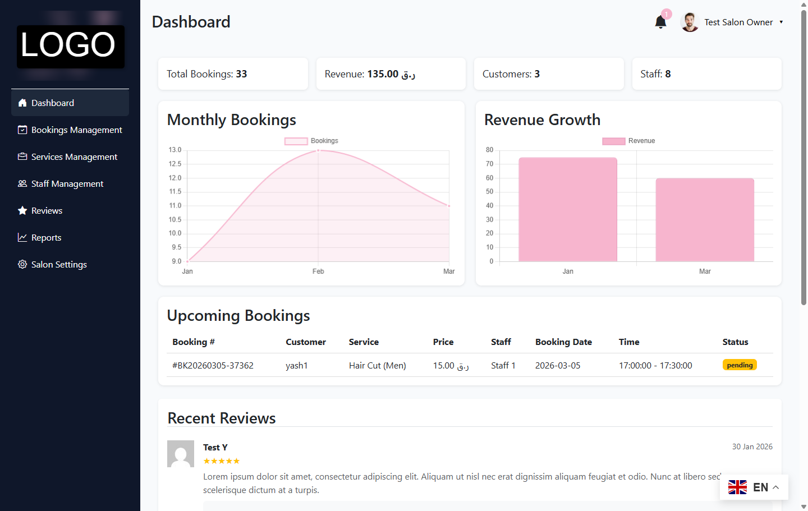
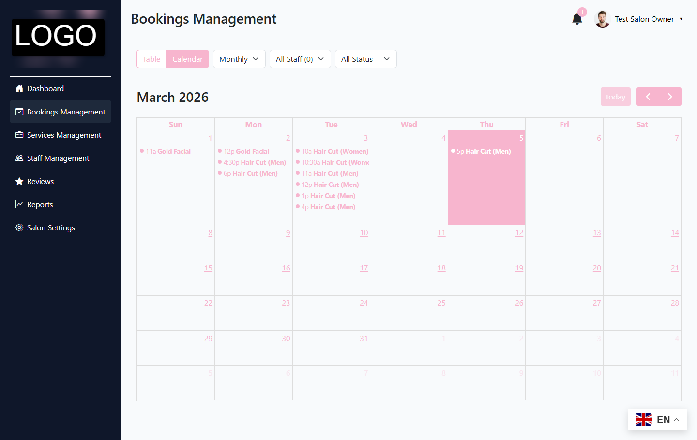
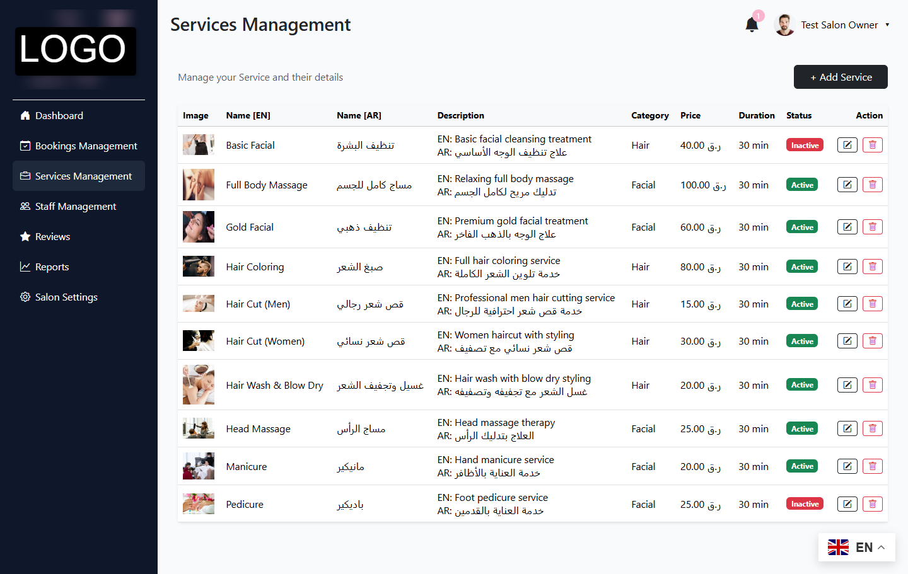
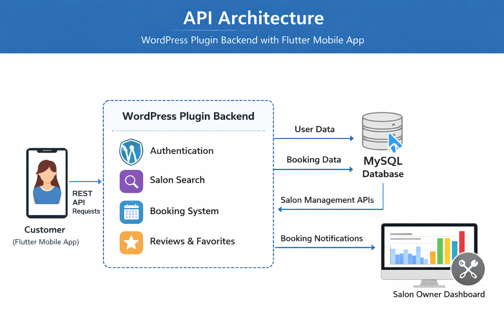

# 💇 Salon Booking System – WordPress Plugin API Backend

🌐 Portfolio  
https://mukeshprajapat026.github.io/

---

## 📌 Project Type

Mobile Booking Platform Backend  
WordPress Plugin + REST API + Flutter Mobile Integration

---

## 🚀 Overview

The Salon Booking System is a custom backend platform built as a **WordPress plugin** designed to power a **Flutter-based mobile application** for salon discovery and appointment booking.

The system allows customers to:

- Discover nearby salons
- View available services
- Book appointments with available staff
- Manage bookings
- Leave reviews and ratings
- Receive booking notifications

Salon owners manage operations through a **custom WordPress dashboard**, while the **Flutter mobile application consumes REST APIs exposed by the plugin**.

The objective was to build a **scalable and flexible booking platform backend** connecting a mobile application with salon business management tools.

---

## 🎯 Business Problem

Before implementing the platform:

- Appointments were handled manually
- No centralized booking management system
- Customers struggled to find available time slots
- Salon owners had difficulty managing staff schedules
- No real-time booking system
- No integrated review or feedback system

This resulted in:

- Operational inefficiencies
- Scheduling conflicts
- Poor customer experience
- Limited visibility for salons

---

## 💡 Solution

A **custom WordPress plugin backend** was developed that powers both the mobile app and the salon management dashboard.

The system provides:

1. Mobile authentication and user profiles
2. Salon discovery and search functionality
3. Staff availability scheduling
4. Real-time booking system
5. Booking rescheduling and cancellation
6. Customer reviews and ratings
7. Favorite salons feature
8. Notification system for booking updates

The plugin exposes **secure REST APIs consumed by the Flutter mobile application**.

---

## 🏗 System Architecture

```
Customer (Flutter Mobile App)
│
▼
WordPress REST API
│
▼
Custom WordPress Plugin
│
├── Authentication Module
├── Salon Discovery Engine
├── Booking Management System
├── Reviews & Ratings Module
├── Favorites System
├── Notification Engine
│
▼
MySQL Database
│
▼
Salon Owner Dashboard (WordPress)
```

The **WordPress plugin acts as the central backend service layer** handling all booking logic and data management.

---

## 🔄 Booking Workflow

### Mobile App User Flow

1. User logs in using Firebase authentication
2. User searches for nearby salons
3. User views salon services and staff
4. User selects available booking date and time
5. Booking is created through REST API
6. System generates booking confirmation
7. User manages bookings from the mobile app

---

## 📊 Core Platform Modules

### 🔐 Authentication

- Firebase token authentication
- Secure API token handling
- User profile management

### 🔍 Salon Discovery

- Featured salons
- Nearby salons using geolocation
- Top-rated salons
- Category-based search

### 📅 Booking System

- Staff availability checking
- Time slot selection
- Booking creation
- Booking rescheduling
- Booking cancellation
- QR code generation for salon check-in

### ⭐ Reviews & Ratings

- Customers can rate completed bookings
- Reviews appear on salon profiles
- Rating distribution and analytics

### ❤️ Favorites

- Save favorite salons
- Quick access to preferred salons

### 🔔 Notifications

- Booking confirmations
- Booking updates
- System alerts
- Unread notification counters

---

## ⚙️ Tech Stack

| Layer | Technology |
|------|------------|
| Backend | WordPress Plugin (PHP) |
| API Layer | WordPress REST API |
| Database | MySQL |
| Mobile App | Flutter |
| Authentication | Firebase |
| Booking Engine | Custom PHP Logic |
| Notifications | WordPress Notification System |

---

## 🔔 API Infrastructure

The plugin exposes **24 REST API endpoints** used by the Flutter mobile application.

### Authentication
POST /auth/register
POST /auth/login

### Profile
GET /profile
POST /profile/update

### Salon Discovery
GET /home
GET /search
GET /salon/{id}

### Bookings
GET /booking/availability
POST /booking/create
GET /bookings
POST /booking/{id}/cancel
POST /booking/reschedule

### Reviews
POST /review/create
GET /salon/{id}/reviews

### Favorites
POST /favorite/toggle
GET /favorites

### Notifications
GET /notifications
POST /notifications/read
POST /notifications/read-all

---

## 👤 Customer Experience Flow

1️⃣ Install mobile application  
2️⃣ Login with phone authentication  
3️⃣ Discover salons nearby  
4️⃣ Browse services and staff  
5️⃣ Select available booking slot  
6️⃣ Confirm appointment  
7️⃣ Receive booking confirmation  
8️⃣ Leave review after service completion

---

## 📊 Business Impact

- 📱 Enabled mobile-based salon booking platform
- ⚡ Real-time appointment scheduling
- 📈 Improved salon discovery and booking conversion
- 🔄 Centralized booking management for salon owners
- ⭐ Integrated customer review system

---

## 👨‍💻 My Role

- System Architecture Design
- WordPress Plugin Development
- REST API Development
- Booking Engine Implementation
- Database Design
- Flutter API Integration Support
- Salon Owner Dashboard Development
- Full Backend System Development

---

## 🖼 Screenshots

### 1️⃣ Salon Owner Dashboard  
*(Sensitive information blurred)*  



---

### 2️⃣ Booking Management  



---

### 3️⃣ Service Management  



---

### 4️⃣ API Architecture  



---

## 📁 Repository Structure (Case Study Only)

This repository contains **documentation and screenshots only**.

```
salon-booking-wordpress-api-case-study/
│
├── README.md
└── screenshots/
├── salon-dashboard.png
├── salon-bookings.png
├── salon-services.png
└── api-architecture.png
```

---

## 🔐 Source Code Notice

This repository is a **public case study**.

The production source code is kept private due to:

- Client confidentiality
- API credential security
- Business workflow protection
- Production infrastructure privacy

Technical architecture discussions are available upon request.

---

## 🌐 Portfolio

Live Portfolio

https://mukeshprajapat026.github.io/

---

## 📬 Contact

**Mukesh Prajapat**  
Full Stack Developer  

WordPress • Laravel • API Development • Automation Systems  

---

> Built as a scalable backend architecture for mobile-based salon booking platforms.